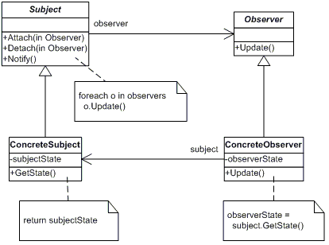

# The Observer Pattern:

defines a one-to-many dependency between objects so that when one object changes state, all of its dependents are notified and updated automatically.

Publisher = Subject.
Subscribers = Observers.
Publishers + Subscribers = Observer Pattern.

## Structure UML

## Actors

- **Subject**
  - knows its observers. Any number of Observer objects may observe a subject
  - provides an interface for attaching and detaching Observer objects.
- **ConcreteSubject**
  - stores state of interest to ConcreteObserver
  - sends a notification to its observers when its state changes
- **Observer**
  - defines an updating interface for objects that should be notified of changes in a subject.
    **ConcreteObserver**
  - maintains a reference to a ConcreteSubject object
  - stores state that should stay consistent with the subject's
  - implements the Observer updating interface to keep its state consistent with the subject's

## Loose Coupling

When two objects are loosely coupled, they can interact, but have very little knowledge of each other.

The Observer Pattern provides an object design where subjects and observers are loosely coupled.

Why?

The only thing the subject knows about an observer is that it implements a certain interface (the Observer interface). It doesn’t need to know the concrete class of the observer, what it does, or anything else about it.
