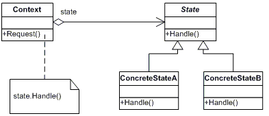

# The State Pattern

The State Pattern allows an object to alter its behavior when its internal state changes. The object will appear to change its class.

## Structure UML

## Actors

- **Context**
  - defines the interface of interest to clients
  - maintains an instance of a ConcreteState subclass that defines the current state.
- **State**
  - defines an interface for encapsulating the behavior associated with a particular state of the Context.
    **Concrete State**
  - each subclass implements a behavior associated with a state of Context
