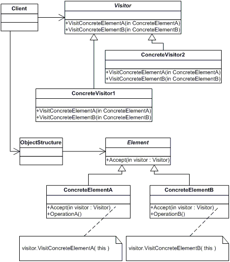

# Visitor:

Represent an operation to be performed on the elements of an object structure. Visitor lets you define a new operation without changing the classes of the elements on which it operates.

## Structure UML

## Actors

- Visitor
  - declares a Visit operation for each class of ConcreteElement in the object structure. The operation's name and signature identifies the class that sends the Visit request to the visitor. That lets the visitor determine the concrete class of the element being visited. Then the visitor can access the elements directly through its particular interface
- ConcreteVisitor
  - implements each operation declared by Visitor. Each operation implements a fragment of the algorithm defined for the corresponding class or object in the structure. ConcreteVisitor provides the context for the algorithm and stores its local state. This state often accumulates results during the traversal of the structure.
- Element
  - defines an Accept operation that takes a visitor as an argument.
- ConcreteElement
  - implements an Accept operation that takes a visitor as an argument
- ObjectStructure
  - can enumerate its elements
  - may provide a high-level interface to allow the visitor to visit its elements
  - may either be a Composite (pattern) or a collection such as a list or a set
