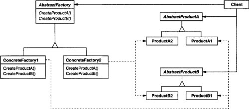

## The Abstract Factory

The Abstract Factory Pattern provides an interface for creating families of related or dependent objects without specifying their concrete classes.

## Structure UML

## Actors

abstract products
creators
