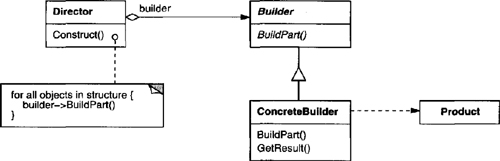

# Builder

It's a creational design pattern that lets you construct complex objects step by step. The pattern allows you to produce different types and representations of an object using the same construction code.

Use the Builder Pattern to encapsulate the construction of a product and allow it to be constructed in steps.

## Structure UML

## Actors

- **Builder**

  - specifies an abstract interface for creating parts of a Product object

- **ConcreteBuilder**

  - constructs and assembles parts of the product by implementing the Builder interface
  - defines and keeps track of the representation it creates
  - provides an interface for retrieving the product

- **Director**

  - constructs an object using the Builder interface

- **Product**
  - represents the complex object under construction. ConcreteBuilder builds the product's internal representation and defines the process by which it's assembled
  - includes classes that define the constituent parts, including interfaces for assembling the parts into the final result

## Benefits of Builder

- Encapsulates the way a complex object is constructed.
- Allows objects to be constructed in a multistep and varying process (as opposed to one-step factories).
- Hides the internal representation of the product from the client.
- Product implementations can be swapped in and out because the client only sees an abstract interface.

## Builder uses and drawbacks

Often used for building composite structures.
Constructing objects requires more domain knowledge of the client than when using a Factory.
