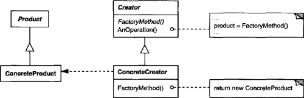

# The Factory Method:

The Factory Method Pattern defines an interface for creating an object, but lets subclasses decide which class to instantiate. Factory Method lets a class defer instantiation to subclasses.

## Structure UML

## Two Actors:

Creator Class
Product Class
