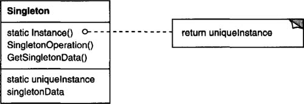

# Singleton

Ensure a class only has one instance, and provide a global point of access to it.

## Structure UML

## Actors

- Singleton (LoadBalancer)
  defines an Instance operation that lets clients access its unique instance. Instance is a class operation.
  responsible for creating and maintaining its own unique instance.
