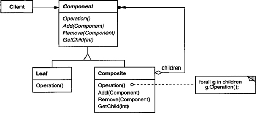
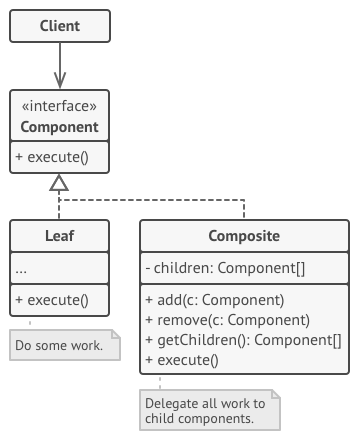

# Composite

Compose objects into tree structures to represent part-whole hierarchies. Composite lets clients treat individual objects and compositions of objects uniformly.

## Structure UML

### Original UML from GOF

### Improved structured based on interface instead of a abstract class

This structure doesn't violate the Interface Segregation Principal since the Leaf and Component are both interfaces of Component and only uses the method we'll need.

## Actors:

**The Component interface** describes operations that are common to both simple and complex elements of the tree.

**The Leaf** is a basic element of a tree that doesn’t have sub-elements (children).
Usually, leaf components end up doing most of the real work, since they don’t have anyone to delegate the work to.
defines behavior for primitive objects in the composition.

**The Container (aka composite)** is an element that has sub-elements:
leaves or other containers. A container doesn’t know
the concrete classes of its children. It works with all sub-elements
only via the component interface.

**The Client** works with all elements through the component
interface. As a result, the client can work in the same way with
both simple or complex elements of the tree.

### References

[Refactoring Guru composite](https://refactoring.guru/design-patterns/composite)

[Do Factory composite](https://www.dofactory.com/net/composite-design-pattern)

[Head First Design Patterns](https://www.amazon.es/Head-First-Design-Patterns-Brain-Friendly-ebook/dp/B00AA36RZY/ref=sr_1_1?__mk_es_ES=%C3%85M%C3%85%C5%BD%C3%95%C3%91&keywords=head+first+design+patterns&qid=1583686314&s=digital-text&sr=1-1)

[Gang Of Four](https://www.amazon.es/Design-Patterns-Object-Oriented-Addison-Wesley-Professional-ebook/dp/B000SEIBB8)
