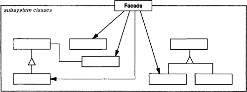
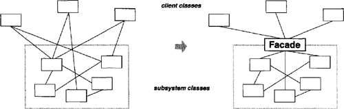

# Facade

Provide a unified interface to a set of interfaces in a subsystem. Facade defines a higher-level interface that makes the subsystem easier to use.

It provides a simplified interface to a library, a framework, or any other complex set of classes.

The Facade class provides a simple interface to the complex logic of one or several subsystems. The Facade delegates the client requests to the appropriate objects within the subsystem. The Facade is also responsible for managing their lifecycle. All of this shields the client from the undesired complexity of the subsystem.

## Structure UML

## Actors

- **Facade**

  - knows which subsystem classes are responsible for a request.
  - delegates client requests to appropriate subsystem objects.

- **Subsystem classes**

  - implement subsystem functionality.
  - handle work assigned by the Facade object.
  - have no knowledge of the facade and keep no reference to it.

## Motivation

Structuring a system into subsystems helps reduce complexity. A common design goal is to minimize the communication and dependencies between subsystems. One way to achieve this goal is to introduce a facade object that provides a single, simplified interface to the more general facilities of a subsystem.

